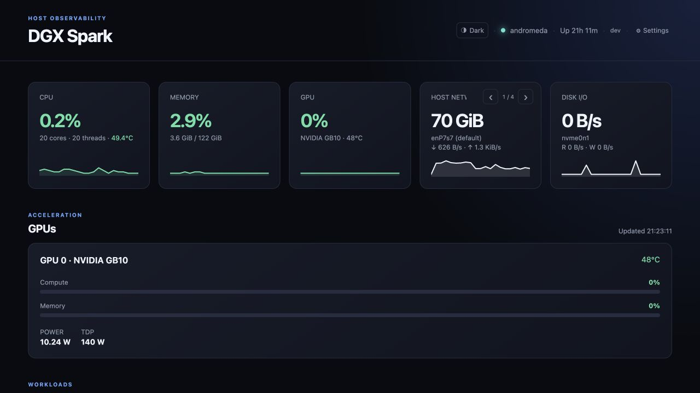

# DGX Spark Dashboard

[](https://github.com/singhangadin/DGX-Spark-Dashboard/releases/latest)
[](LICENSE)
[](https://www.nvidia.com/en-us/products/workstations/dgx-spark/)

[](https://www.buymeacoffee.com/singhangad.in)



> A lightweight, self-hosted dashboard for monitoring an NVIDIA DGX Spark.

DGX Spark Dashboard gives you a modern view of your system without a database,
cloud service, agent daemon, or frontend framework. It runs as a single Docker
Compose service and collects only the metric categories you enable. Host CPU,
memory, uptime, network, and disk metrics come from narrow, read-only host
kernel files; their API payloads identify the source explicitly.

> This is an independent community project. It is not affiliated with or
> endorsed by NVIDIA.

## ✨ Highlights

- 🧠 **CPU** — utilization, core/thread count, frequency, and exposed CPU/SoC temperature
- 🎮 **NVIDIA GPU** — utilization, temperature, power draw, VRAM where the driver exposes it, and a GPU workload view
- 💾 **Memory & I/O** — RAM and swap usage, per-interface host-network rates, free disk space, and per-disk read/write throughput
- 🐳 **Docker** — container name, image, status, CPU, and memory usage
- 🌗 **Themes** — light, dark, and system appearance modes
- 📈 **Views** — switchable chart and text modes for the summary cards and GPU details
- 📱 **Responsive** — mobile-friendly layout with settings that disable collection at the source
- ⚡ **One command** — Docker Compose install, with NVIDIA runtime and CDI support

## 🚀 Quick start

### 📋 Requirements

- An NVIDIA DGX Spark running its supported Linux software stack
- Administrator (`sudo`) access for first-time Docker and Compose setup
- A working NVIDIA driver and NVIDIA Container Toolkit (`nvidia-smi` must work
  on the DGX Spark host)

For the quickest setup on a new host, run:

```sh
curl -fsSL https://raw.githubusercontent.com/singhangadin/DGX-Spark-Dashboard/main/install.sh | sh
```

Open [http://localhost:8787](http://localhost:8787).

The installer downloads a checksum-verified deployment bundle from the latest
GitHub Release and pulls its prebuilt, versioned ARM64 image from GitHub
Container Registry. It does **not** clone the repository or compile the image on
the DGX Spark. It creates `.env`, installs Docker and Compose when required,
detects NVIDIA runtime or CDI integration, and checks the local health endpoint.

If Docker is installed for the first time, the script adds the invoking user to
the `docker` group and continues setup automatically when the system supports
`sg`. Otherwise, sign out and back in once, then run `./install.sh` again.

### 📌 Install a specific version

Release tags follow `vMAJOR.MINOR.PATCH`; container tags use `MAJOR.MINOR.PATCH`.
Pin an installation by passing the version to the shell receiving the installer:

```sh
curl -fsSL https://raw.githubusercontent.com/singhangadin/DGX-Spark-Dashboard/main/install.sh | DGX_DASHBOARD_VERSION=1.0.0 sh
```

The selected tag is saved in `.env`, so subsequent `./install.sh` runs remain
on that version until you change `DASHBOARD_VERSION`. The default is `latest`.

### 🛠️ Use `wget` or develop from source

Use `wget` instead of `curl` if you prefer:

```sh
wget -qO- https://raw.githubusercontent.com/singhangadin/DGX-Spark-Dashboard/main/install.sh | sh
```

To inspect or change the source, clone the repository. In a source checkout,
the same installer detects `docker-compose.dev.yml` and builds the local code:

```sh
git clone https://github.com/singhangadin/DGX-Spark-Dashboard.git
cd DGX-Spark-Dashboard
./install.sh
```

The release installer stores only its small deployment bundle and persistent
settings under `~/DGX-Spark-Dashboard`. Re-running the one-line command safely
refreshes managed deployment files while preserving `.env` and `data/`. It
refuses to overwrite a source checkout or unrelated directory. To use another
location, set `DGX_DASHBOARD_DIR` for the shell receiving the script:

```sh
curl -fsSL https://raw.githubusercontent.com/singhangadin/DGX-Spark-Dashboard/main/install.sh | DGX_DASHBOARD_DIR=/opt/dgx-spark-dashboard sh
```

### 🔌 Change the port

Edit `.env` and set a different port, then run the installer again:

```sh
DASHBOARD_PORT=8788
```

```sh
./install.sh
```

The dashboard will then be available at `http://localhost:8788`.

## 📊 What the dashboard collects

| Category | Data shown | How to disable it |
| --- | --- | --- |
| 🧠 CPU | Utilization, cores, threads, frequency, CPU/SoC temperature when exposed | Settings → CPU |
| 🎮 NVIDIA GPU | Utilization, temperature, power draw, memory where available | Settings → NVIDIA GPU |
| 💾 Memory | RAM and swap use | Settings → RAM & swap |
| 🌐 Network | Host traffic and current receive/send rate for each useful interface | Settings → Host network totals |
| 📀 Disk | Free space on the filesystem holding the installation, plus read/write throughput for every physical disk | Settings → Host disk I/O |
| 🐳 Docker | Containers, state, image, CPU, and memory use | Settings → Docker containers |

Disabled categories are not collected. For example, disabling NVIDIA GPU skips
the NVML (NVIDIA driver) query and disabling Docker skips all Docker socket calls.
When multiple host network interfaces or physical disks are present, use the arrow
controls on their summary cards—or swipe on a touch screen—to move between
sources. The default-route interface is identified in the network carousel.

## 🪶 Resource usage

The dashboard is demand-driven: it runs no background collector and reads metrics
only when a browser requests them. Measured on a DGX Spark (GB10, 20-core Arm)
with all six categories enabled:

| Measurement | Value |
| --- | --- |
| 📦 Container image | ~190 MB |
| 🧵 Memory (RSS) | ~57 MiB, idle or serving (~0.045% of 128 GB) |
| 💤 CPU, no dashboard open | ~0.1% of one core — just the 30 s healthcheck |
| 🔥 CPU, one dashboard open at 2 s refresh | ~0.9% of one core |
| ⏱️ `/api/metrics`, all categories | ~2.0 s |
| ⚡ `/api/metrics`, Docker category disabled | ~12 ms |
| 🎮 GPU collection alone (NVML) | ~1.3 ms per poll |

> 🪶 **For comparison:** NVIDIA's standard GPU observability stack (DCGM Exporter +
> Prometheus + Grafana) runs **3 always-on containers** using **~600 MiB RAM** and
> **~2.5 GB** of images, scraping continuously whether or not anyone is watching —
> roughly **10× the memory** and **13× the disk** of this dashboard. That stack does
> more (history, alerting, the full DCGM field set); this one is a live-only glance
> at a single DGX Spark.

Docker container statistics dominate the request time: Docker's stats API samples
each container over a fixed interval, which sets a floor of about two seconds no
matter how many containers are running. Every other category is a fast read of
host kernel files, so turning off categories you do not need in **Settings**
removes their cost entirely — with Docker off, a full poll takes ~12 ms.

GPU telemetry is read through NVML (the library `nvidia-smi` itself wraps) over a
cached session, so a poll costs about 1.3 ms and forks no process. The resident
NVIDIA driver library is why the memory figure sits near 57 MiB rather than the
~44 MiB of releases before 1.0.1; it is a fixed, one-time cost that does not grow
with uptime or poll count.

## ⚙️ Dashboard settings

Open **Settings** in the header to choose:

- Refresh interval from 1 to 60 seconds
- Which metric categories to collect
- Whether the top CPU, memory, GPU, network, and disk-I/O cards use live sparklines or text-only values
- Whether GPU details use utilization bars or compact text values

Use the header appearance button to cycle through **Auto**, **Light**, and
**Dark**. All preferences persist in `data/settings.json` across container
rebuilds and upgrades. Collection and display settings save immediately when a
switch or refresh interval changes; there is no separate Save action.

## 🧰 Operations

Run these commands from the installation directory:

```sh
docker compose ps          # service status
docker compose logs -f     # follow logs
docker compose down        # stop the dashboard; settings remain in ./data
./install.sh               # pull and start the configured release version
```

To update an installation tracking `latest`:

```sh
./install.sh
```

To move a pinned installation to another release, edit `.env`, set
`DASHBOARD_VERSION=X.Y.Z`, and run `./install.sh`. Re-running the original curl
command also refreshes the deployment bundle from the latest GitHub Release.

To remove it:

```sh
docker compose down --rmi all
```

Remove the project directory and `data/` as well only if you also want to
discard saved dashboard preferences.

## 🎮 GPU telemetry notes

The dashboard uses NVIDIA's tooling available inside the NVIDIA Container
Toolkit environment. If the GPU panel says telemetry is unavailable:

1. Confirm the host sees the GPU: `nvidia-smi`
2. Install or repair the NVIDIA Container Toolkit.
3. Run `./install.sh` again so it can select NVIDIA runtime or CDI support.

Some driver fields are hardware-dependent. A dash beside **LIMIT** means
the driver did not expose a live configurable GPU power-limit value. It does
not mean that power monitoring has failed; **POWER** can still report current
draw. The DGX Spark's published GB10 TDP is a hardware specification, not
necessarily a live driver power-limit reading.

## 🔒 Security and privacy

The dashboard does not send telemetry to a cloud service. It does require
read-only access to the Docker socket for container statistics and narrow
read-only host mounts for CPU, memory, load, network, disk-I/O, and identity
data. Although the application does not expose Docker control actions, the
Docker socket is sensitive—run the dashboard on a trusted network.

`DASHBOARD_BIND_ADDRESS` in `.env` controls which host addresses the dashboard
listens on. It takes a comma-separated list of literal IPs or interface names,
and loopback is always bound. Prefer naming specific trusted interfaces over
`0.0.0.0` so the dashboard is not served on untrusted NICs:

```sh
# Loopback only (the default)
DASHBOARD_BIND_ADDRESS=127.0.0.1
# Reachable over WireGuard and Tailscale, but no other interface
DASHBOARD_BIND_ADDRESS=wg0,tailscale0
```

Recreate the container after changing it with `./install.sh` (or
`docker compose up -d`).

## 🖥️ DGX Spark reference hardware

The dashboard includes a compact reference card at the bottom of the page. It
summarizes NVIDIA's published DGX Spark platform: GB10 Grace Blackwell, a
20-core Arm CPU, 128 GB unified LPDDR5x memory, up to 1 PFLOP FP4 AI compute,
and ConnectX networking. See the [official NVIDIA DGX Spark
specifications](https://www.nvidia.com/en-us/products/workstations/dgx-spark/)
for the complete and current hardware reference.

## 🤝 Development and contribution

This project intentionally uses FastAPI plus dependency-free HTML, CSS, and
JavaScript. Before contributing, read [AGENTS.md](AGENTS.md) and
[docs/ARCHITECTURE.md](docs/ARCHITECTURE.md). The key checks are:

```sh
python3 -m py_compile backend/app/main.py
docker compose config
docker compose -f docker-compose.yml -f docker-compose.dev.yml build
```

## 🏷️ Releases

The release flow mirrors `singhangad.in`:

1. Open **GitHub → Actions → Release → Run workflow** on `main`.
2. Choose `PATCH`, `MINOR`, or `MAJOR`; CI computes the next value from
   [`VERSION`](VERSION).
3. CI promotes `develop` into `main`, commits `chore(release): vX.Y.Z`, creates
   the annotated SemVer tag, generates notes from `feat:` and `fix:` commits,
   publishes `ghcr.io/singhangadin/dgx-spark-dashboard:X.Y.Z` plus `latest`,
   attaches the checksum-protected deployment bundle to the GitHub Release, and
   syncs the release back into `develop`.

For the first release, set the optional `release_as` input to `1.0.0`. Like the
reference project, this explicit bootstrap tags current `main` without doing
the normal `develop` promotion. Repository Actions must have permission to
write contents and packages; if branch protection is enabled, allow the release
workflow to update `main` and `develop`. The GHCR package must be public for
anonymous one-command installation.

## 📄 License

Copyright 2026 Angad Singh. Licensed under the [Apache License 2.0](LICENSE).

---

<div align="center">

Made with ☕ for the DGX Spark community · not affiliated with NVIDIA

<sub>Built with a little help from Claude &amp; Codex — a few rough edges may remain while they're being smoothed out.</sub>

</div>
